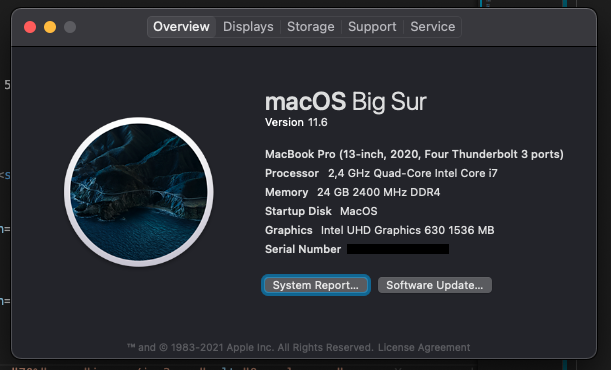
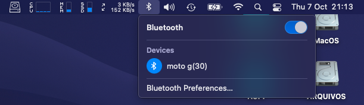
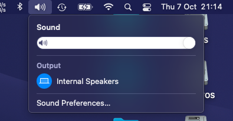
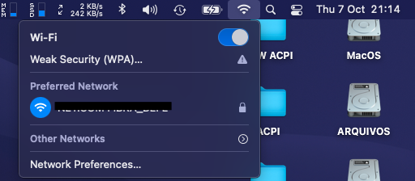

<!DOCTYPE html>
<html lang="en">
<head>
<meta charset="UTF-8">
<meta name="viewport" content="width=device-width, initial-scale=1.0">
<meta http-equiv="X-UA-Compatible" content="ie=edge">
</head>

<body>

<h2>Nitro 5 an517-51-55NT Hackintosh</h2>
<h3>- Opencore 0.7.4</h3>
<h3>- Big Sur 11.6 <a href="https://drive.google.com/file/d/1ZcCYR50zWWtis6dxxKn3AInfBgs7ia6E/view">I used this ISO</a></h3>

 
<h4>This UEFI is initial made from: <a href="https://github.com/SaeedHaidar/Nitro-5-an517-51-Hackintosh">
SaeedHaidar
</a>
, and updated to latest openCore by me. Thanks SaeedHaidar, u are my hero!!
</h4>
 

  

<strong>Images</strong>

 

 
 

 
 

 
 

 
 

 

  

<strong>What's working </strong>

 
<table border="1px">

<tr>
<td>

 WiFi + Bluetooth + Airdrop + Universal Clipboard + Handoff + Continuity Camera + iPhone Cellular Calls (DW1820a) 

</td>

</tr>

<tr>
<td>

Power Managment is very stable most of the time cpu Fan will not load but it depends on what you are doing 

</td>
</tr>

<tr>
<td>

TouchPad + all gestures Finally after month of researching 

</td>
</tr>

<tr>
<td>

 Fully Functional QE/CI Enabled Graphics 

</td>
</tr>

<tr>
<td>

 intel bluetooth and WiFi on AX200 card 

</td>
</tr>

<tr>
<td>

 Display brightness with hot keys 

</td>
</tr>

<tr>
<td>

 FaceTime, Messages, etc... 

</td>
</tr>

<tr>
<td>

 iGPU with disabled dGPU 

</td>
</tr>

<tr>
<td>

Audio & headphone jack 

</td>
</tr>

<tr>
<td>

Battery Management  

</td>
</tr>

<tr>
<td>

 All USB ports

</td>
</tr>

<tr>
<td>

WebCam  

</td>
</tr>

<tr>
<td>

 Ethernet 

</td>
</tr>

<tr>
<td>

Sidecar

</td>
</tr>

<tr>
<td>

 <a style="text-decoration:none" href="https://dortania.github.io/OpenCore-Post-Install/universal/sleep.html">Sleep (Preparations section)</a>

</td>
</tr>

</table>

<strong>Disabled Devices </strong>

 

GTX 1650 

<strong>Bios Settings </strong>

 

<table border="1px">
<tr>
<td>

Main → click on (calt+s) a new setting will appear to change SATA type to AHCI otherwise you will not be able to see you drive when installing hackintosh 

</td>
</tr>

<tr>
<td>

Security → Set supervisor password (to disable secure boot)

</td>
</tr>

<tr>
<td>

Security → Password on boot → Disable

</td>
</tr>

<tr>
<td>

Boot → Secure Boot → Disable

</td>
</tr>

</table>

<strong>Not Working </strong>

 

HDMI (Nvidia Optimus is hardwire to HDMI)

<strong>Info</strong>

 

<table border="1px">
<tr>
<td>

When you switch SATA type to AHCI you might not be able to boot to windows again but do not worry here is a guide i found to switch without getting any issue <a href="https://support.thinkcritical.com/kb/articles/switch-windows-10-from-raid-ide-to-ahci">Here</a>

</td>
</tr>

<tr>
<td>

You need to disable SystemProfilerMemoryFixup.kext if you wanna enter recovery mode or you will get kernel panic

</td>
</tr>

<tr>
<td>

To get right click to work go to touchpad settings in (Secondary click) choose (click in bottom right corner)

</td>
</tr>

<tr>
<td>

If apple Continuity did not worked try logout and login again on all your devices your hackintosh too

</td>
</tr>

<tr>
<td>

OpenCore Guide <a href="https://dortania.github.io/OpenCore-Install-Guide/">Here</a>

</td>
</tr>

</table>

<strong>Updates</strong>

</body>

</html>
